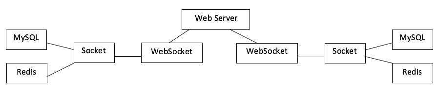

# 原理



# 安装

安装 `ws` 模块:

```sh
$ npm install ws
```

`server.js` 上传到服务器,执行方式:

```sh
$ node server.js
```

然后配置nginx

# Web Server配置

### Apache配置端口转发

```
<VirtualHost *:80>
  ServerName xxx.com
  ProxyPass / ws://127.0.0.1:8001
</VirtualHost>
```

### Nginx配置端口转发

```
map $http_upgrade $connection_upgrade {
  default upgrade;
  ''   close;
}
upstream node_ws {
  server 127.0.0.1:8001;
}
server{
  listen 80;
  server_name xxx.com;
    location /{
    proxy_redirect     off;
    proxy_pass http://node_ws;
    proxy_http_version 1.1;
    proxy_set_header Upgrade $http_upgrade;
    proxy_set_header Connection "upgrade";
  }
}
```

# 使用

然后本地执行:

```
$ node local.js
```

然后就可以使用websocket来转发，比如mysql, redis等

# 配置参数

在`local.js`里:

```
var HOST = '127.0.0.1';   //本地ip
var PORT = 6969;          //本地端口
var SERVER = 'ws://127.0.0.1';  //远程服务器地址

var remote_options={
  ip:'127.0.0.1',      //远程被代理的服务器地址
  port:3306            //远程被代理的端口
};
```
